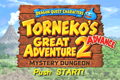
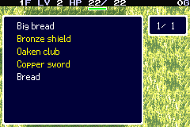
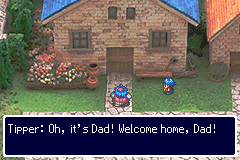
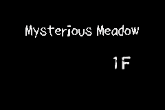

# Torneko 2 Advance — English translation

**Made with AI assistance.** An unofficial English localization of
*Dragon Quest Characters: Torneko no Daibouken 2 Advance — Fushigi no Dungeon*
for Game Boy Advance.

## Screenshots

| English title | Inventory |
|---|---|
|  |  |
| **Dialogue** | **Dungeon arrival** |
|  |  |

Actual mGBA screenshots from the English build, captured through ordinary play
from a fresh save. [Capture details and reproduction](docs/SCREENSHOTS.md).

## Project status

**Whole-game coverage is unverified.** There is no reliable completion
percentage yet. The missed Japanese menu banner exposed a gap in both the
automated coverage checks and visual review. See the
[coverage assessment and audit requirements](docs/COVERAGE_AUDIT.md).

The current development build contains **3,770 inserted text resources and
20 English graphics**, including the approved title, all five corner logos and
13 dungeon names plus the Level label. It uses the readable Torneko 2 compact
English font and supports seven-character player names, including `Torneko`.
The original GBA credits are already English and remain unchanged.

Translation, discovery and playtesting continue. **113 known catalog sources
still need investigation or review**; complete text discovery and full-game
runtime coverage are not yet proven. Insertion counts are not a completion
percentage. The 113-source backlog also excludes missed display paths for
already-reviewed text.

The [dungeon-menu location banner](docs/LOCATION_BANNER.md) now uses the English
names in all 13 locations; the earlier tests had missed this separate reader.

[Current progress and remaining work](docs/TEXT_PROGRESS.md) ·
[Open text questions](docs/TEXT_OPEN_QUESTIONS.md)

## Setup

Use the project's Python 3.11 environment, native mGBA bindings and local tools.
You need your own matching Japanese ROM, identified in [config/rom.json](config/rom.json).
Torneko 3 supplies the tooling reference; this translation uses Torneko 2's
Japanese text and verified resource layouts.

[Installation and tool choices](docs/TOOLING.md)

## Build and play

From the project root:

```sh
./build.sh
```

| Output | Use |
|---|---|
| `build/torneko-2-english.gba` | Open a playtest copy in your GBA emulator |
| `build/torneko-2-english.bps` | Apply to the clean Japanese ROM |
| `build/torneko-2-english.release.json` | Source, ROM and patch hashes; build status |

The build compiles the translation, verifies that the BPS reproduces the ROM,
and runs native emulator checks. Compilation uses retained source assets;
the complete validation workflow also uses the documented research fixtures.
These latest-build files remain development outputs while localization and
playtesting are in progress.

[Build requirements, patching and checks](docs/BUILD.md)

## Translate and revise

Translate from the Japanese, follow the glossary and agreed Dragon Quest
terminology, and preserve controls and substitutions. Check the actual font
and window budgets, including the widest supported names and numbers. Item
names must stay on one line; combat messages should use one line when their
complete meaning safely fits. Revisions need checked insertion ownership and
fresh native validation before they reach the ROM.

[Translation and prose rules](docs/LOCALIZATION_PLAN.md) ·
[Glossary](translations/glossary.json) · [Menu budgets](docs/MENU_LAYOUTS.md)

## Test and report bugs

Play a separate copy of the latest English ROM and keep its battery save beside
it. Preserve the original Japanese ROM and supplied save. When reporting a
problem, include a screenshot, reproduction steps, the matching save/state,
emulator version and ROM hash from the release manifest. A save immediately
before the problem is especially useful for checking a fix.

[Current validation scope](docs/TEXT_PROGRESS.md) ·
[Emulator and capture workflow](docs/EXPLORATION.md)

## Graphics and research

[Title and background logos](docs/TITLE_INSERTION.md) ·
[Arrival cards](docs/ARRIVAL_INSERTION.md) ·
[Credits and graphics auditions](docs/GRAPHICS_AUDITION.md)

Record discoveries in the [memory map](docs/MEMORY_MAP.md) before insertion;
use the shared allocator and checked patch ownership to prevent collisions.

[Documentation index](docs/README.md) · [Graphics discovery queue](docs/GRAPHICS_INVENTORY.md)
